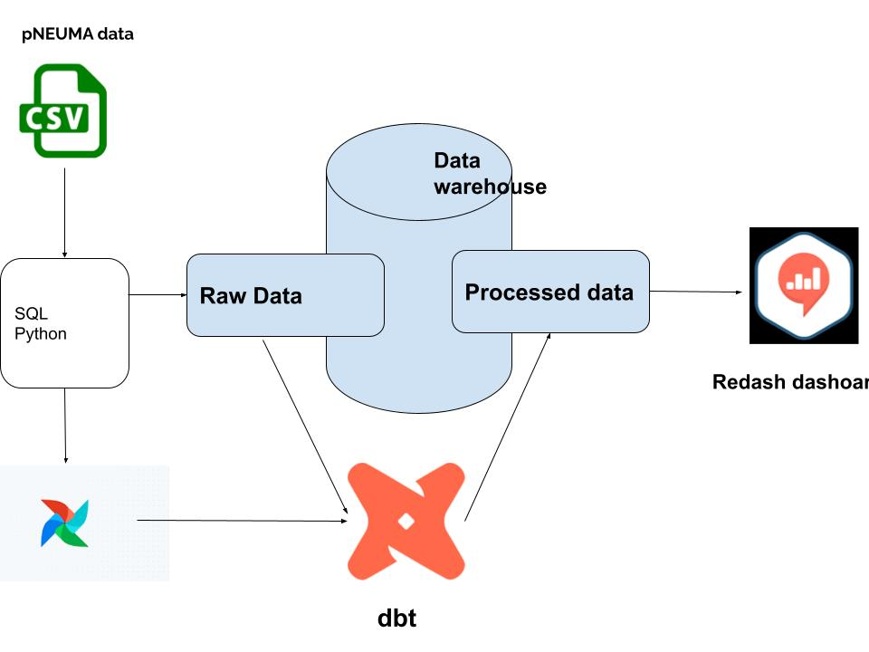

# Traffic-ELT

<div id="top"></div>

<!-- PROJECT SHIELDS -->

[![Contributors][contributors-shield]][contributors-url]
[![Forks][forks-shield]][forks-url]
[![Stargazers][stars-shield]][stars-url]
[![Issues][issues-shield]][issues-url]
[![MIT License][license-shield]][license-url]

<!-- PROJECT LOGO -->
<br />
<div align="center">
  <h3 align="center">Traffic-ELT</h3>

  <p align="center">
    A dockerized ELT pipeline.
    <br />
    <a href="https://open-traffic-dbt-doc.netlify.app"><strong>Explore the docs »</strong></a>
    <br />
    <br />
    <a href="https://github.com/bwibokhaabi/traffic_dwh/issues">Report Bug</a>
    ·
    <a href="https://github.com/bwibokhaabi/traffic_dwh/issues">Request Feature</a>
  </p>
</div>

<!-- TABLE OF CONTENTS -->
<details open="open">
  <summary>Table of Contents</summary>
  <ol>
    <li>
      <a href="#about-the-project">About The Project</a>
      <ul>
        <li><a href="#built-with">Built With</a></li>
      </ul>
    </li>
    <li>
      <a href="#getting-started">Getting Started</a>
      <ul>
        <li><a href="#prerequisites">Prerequisites</a></li>
        <li><a href="#installation">Installation</a></li>
      </ul>
    </li>
    <li><a href="#contributing">Contributing</a></li>
    <li><a href="#license">License</a></li>
    <li><a href="#contact">Contact</a></li>
    <li><a href="#acknowledgements">Acknowledgements</a></li>
  </ol>
</details>

<!-- ABOUT THE PROJECT -->

## About The Project


A dockerized Extract, Load, Transform (ELT) pipeline with PostgreSQL, Airflow, DBT, and a Redash.

### Built With

Tech Stack used in this project

- [![Docker][docker.com]][docker-url]
- [![Postgres][postgresql.com]][postgresql-url]
- [![Airflow][airflow.com]][airflow-url]
- [![DBT][dbt.com]][dbt-url]
- [![Redash][redash.com]][redash-url]

<!-- GETTING STARTED -->

## Getting Started

### Prerequisites

Make sure you have docker installed on local machine.

- Docker
- Docker Compose

### Installation

1. Clone the repo
   ```sh
   git clone https://https://github.com/DiyeMark/Traffic-ELT.git
   ```
2. Navigate to the folder
   ```sh
   cd Traffic-ELT
   ```
3. Build an airflow image
   ```sh
   docker build . --tag apache_dbt/airflow:2.3.3
   ```
4. Run
   ```sh
    docker-compose up
   ```
5. Open Airflow web browser
   ```JS
   Navigate to `http://localhost:8080/` on the browser
   activate and trigger load_dag
   activate and trigger dbt_dag
   ```
6. Access redash dashboard
   ```JS
   Navigate to `http://localhost:5000/` on the browser
   ```

<!-- CONTRIBUTING -->

## Contributing

Contributions are what make the open source community such an amazing place to learn, inspire, and create. Any contributions you make are **greatly appreciated**.

1. Fork the Project
2. Create your Feature Branch (`git checkout -b feature/AmazingFeature`)
3. Commit your Changes (`git commit -m 'Add some AmazingFeature'`)
4. Push to the Branch (`git push origin feature/AmazingFeature`)
5. Open a Pull Request

<!-- LICENSE -->

## License

Distributed under the MIT License. See `LICENSE` for more information.

<!-- CONTACT -->

## Contact

Denamo Markos - daisyokacha9@gmail.com

<!-- ACKNOWLEDGMENTS -->

## Acknowledgments

- [10 Academy](https://www.10academy.org/)

[redash-url]: https://redash.io/
